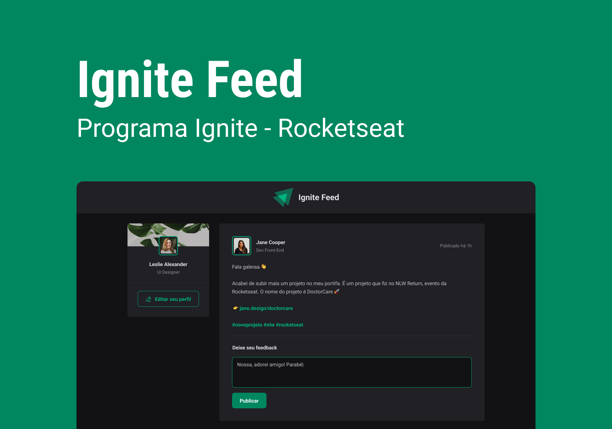

<h1 align="center"> Ignite Feed </h1>

Primeiro projeto desenvolvido durante o bootcamp Ignite da Rocketseat.

  <a href="#-tecnologias">Tecnologias</a>&nbsp;&nbsp;&nbsp;|&nbsp;&nbsp;&nbsp;
  <a href="#-projeto">Projeto</a>&nbsp;&nbsp;&nbsp;|&nbsp;&nbsp;&nbsp;
  <a href="#-layout">Layout</a>&nbsp;&nbsp;&nbsp;|&nbsp;&nbsp;&nbsp;
  <a href="#-como-executar">Como executar</a>

 

  

## 💻 Projeto

O Ignite Feed é um projeto simples de feed de rede social onde podemos ver nosso perfil, postagens e aplaudir, visualizar ou remover um comentário. Também pode-se criar um novo comentário dentro de um postagem já existente mas não é possível criar novas postagens.

## ✨ Tecnologias

Esse projeto foi desenvolvido com as seguintes tecnologias:

- ReactJS
- CSS Modules
- Phosphor Icons

## 🚀 Como executar

Para executar a aplicação é necessário usar os seguintes comandos no terminal:
- `npm install` para instalar as dependências da aplicação.
- `npm run dev` para executar a aplicação.

## 🔖 Layout

Você pode visualizar o layout do projeto através [DESSE LINK](https://www.figma.com/file/1WH0KoYUQcXtMGybZaIcUw/Ignite-Feed?node-id=0%3A1&t=A60szGMfvy3GzGVF-1).

